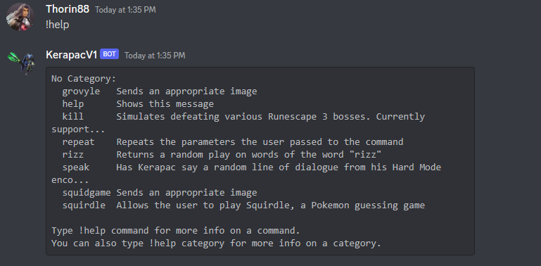
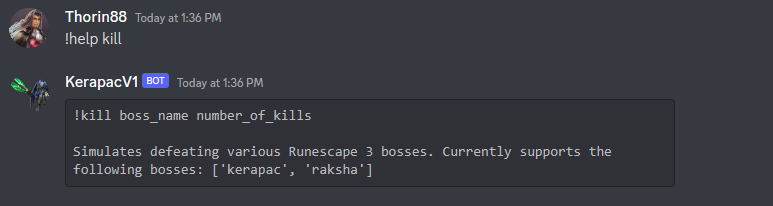
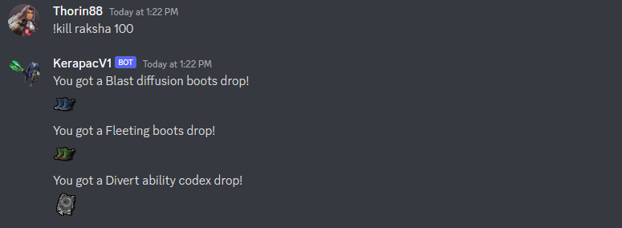
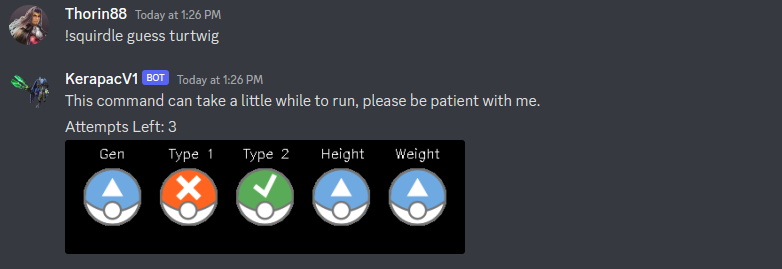

# My First Discord Bot

A project I've taken on to practise consuming/using unfamilar API. Also gained experience using Docker, and best practices regarding code layout for Docker.

# Bot Functionality / Commands Supported

Some examples of the bot's functionality are showcased below.

## `!help`

Once the bot is running, you can also use `!help` and `!help command_name` for more information on the commands available. For example:

and for more detailed help per command:

## `!kill`

## `!squirdle`

## `!rizz`

## `!speak`

## Regular Message Responses

The bot recognises some basic phases within messages, such as greetings:

and other useful things like:

# Setup + Running

This section contains instructions on getting the code running. It is recommended to use the Docker based setup, if possible.

## Bot Token

To run a bot on Discord, you first need to create the bot on the Discord website. Once created, you need to retrieve the bot's secret token.

You then need to add this token to the code base. Specifically, create a file called `secrets.txt` in the `secrets/` directory. The file should then contain a single line in the format:

`token your_bots_secret_token`

This step is also needed when running the code with Docker.

## Option 1: Docker (Recommended)

1) Navigate to the root directory of the code base.

2) Start up Docker on your machine.

3) Build the Docker Image.

`docker build -t kerapac-v1 .`

4) Run the Docker Container

`docker run --name kerapac-v1-container -it kerapac-v1`

5) To stop the container, use `Ctrl + C`.

## Option 2: Run Locally

### First Time Setup

1) Navigate to the root directory of the code base.

2) Create a new python environment, making sure to use Python 3.6+.

`python -m venv bot_py_env`

3) Activate the environment.

`cd bot_py_env/Scripts/ && . activate && cd ../../` (windows)

4) Confirm that you are now using the virtual environment.

`pip list`

This command should only show a couple of installed packages.

5) Upgrade `pip` (optional)

`pip install --upgrade pip`

6) Install the project's dependancies.

`pip install -r requirements.txt`

If there were any issues with the installation process, either consider using Docker, or tweak the versions of the packages as needed.

### Running the code

1) Navigate to the root directory of the code base.

2) Activate the Python environment we created.

`cd bot_py_env/Scripts/ && . activate && cd ../../` (windows)

3) Navigate to the `bot_code/` directory.

4) Start the bot by running:

`python main.py`

Optionally including `--cold-start` if running the bot for the first time.

5) Use `Ctrl + C` to shutdown the bot.

# Data Scraping

The bot scrapes data that it needs when `--cold-start` is specified when running the bot. The data it collects can be added too by editing the file `bot_code/scraper.py`.

New data can be provided in the form specified at the start of that file.